# Material Audacity

[](https://github.com/audacity/audacity/actions/workflows/au4_check_unit_tests.yml)

A Material Design 3 rebuild of the Audacity 4 shell: the same multi track
audio editor and recorder, with the original editing engine, wrapped in a
full Material 3 token engine, component library, and a large set of
accessibility, customization, and productivity features. Upstream project:
[Audacity](https://www.audacityteam.org).

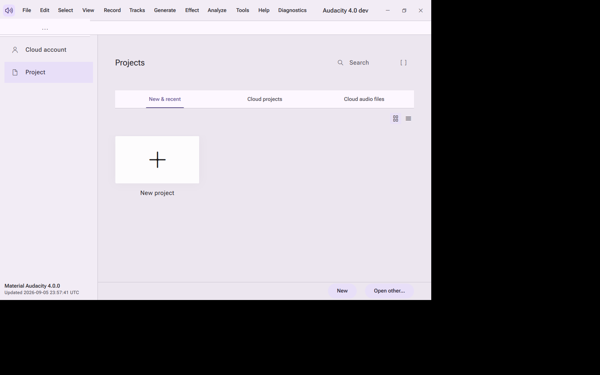

The home page, a real capture from the built application under Xvfb.

Fresh Windows machine, one command:

```bat
.\build.bat --run
```

Documentation site: [docs/site](docs/site/index.html) (published at
`https://ding-ding-projects.github.io/audacity/` once GitHub Pages is
enabled by the repository owner, see [HANDOFF.md](HANDOFF.md)).

Contents: [Screenshots](#screenshots) · [Features](#features) ·
[No unsolicited interruptions](#no-unsolicited-interruptions) ·
[Build and install](#build-and-install) ·
[Automatic updates](#automatic-updates) · [Languages and accessibility](#languages-and-accessibility) ·
[Line count and estimated build time](#line-count-and-estimated-build-time) ·
[Verification](#verification) · [Screen recording](#screen-recording) ·
[Contributing and license](#contributing-and-license)

## Screenshots

Every image below is a real capture taken under Xvfb from the actual built
Linux binary, not a mockup. The same set, grouped and filterable, is also on
the [documentation site's Gallery page](docs/site/index.html#gallery).

<details open>
<summary><strong>Home</strong></summary>


Home page in the light theme: New project tile, New and recent tab, grid
and list view toggles.

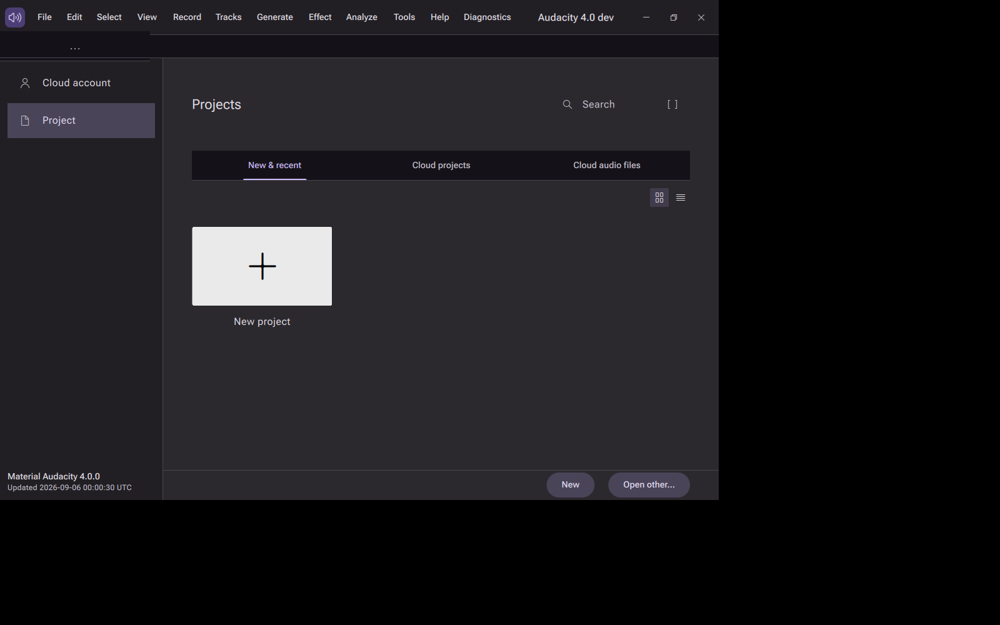

The same home page in the dark theme, showing the Material 3 dark color
roles. Capture: `phase2`.

</details>

<details>
<summary><strong>First run</strong></summary>

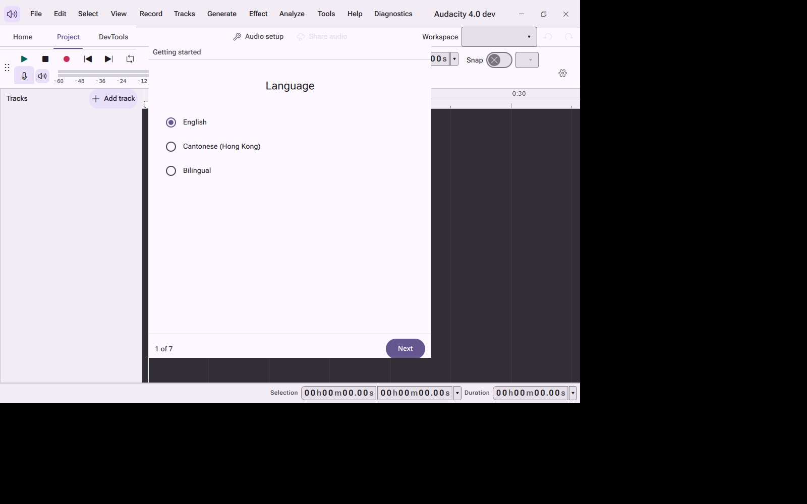

First launch setup, step 1 of 7: choosing English, Cantonese (Hong Kong),
or Bilingual. Capture: `lane-b`.

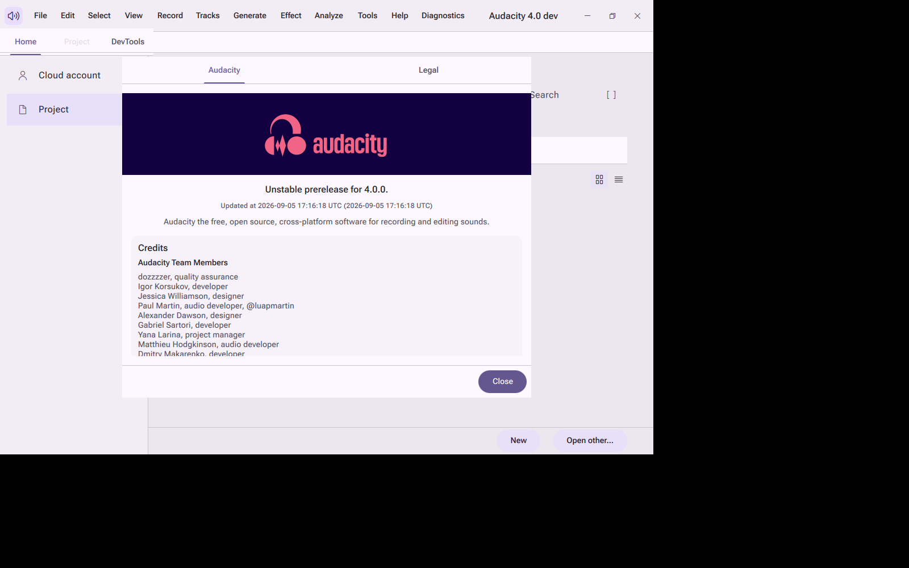

The About dialog, with Audacity and Legal tabs and a scrolling credits
list. Capture: `lane-b`.

</details>

<details>
<summary><strong>Preferences</strong></summary>

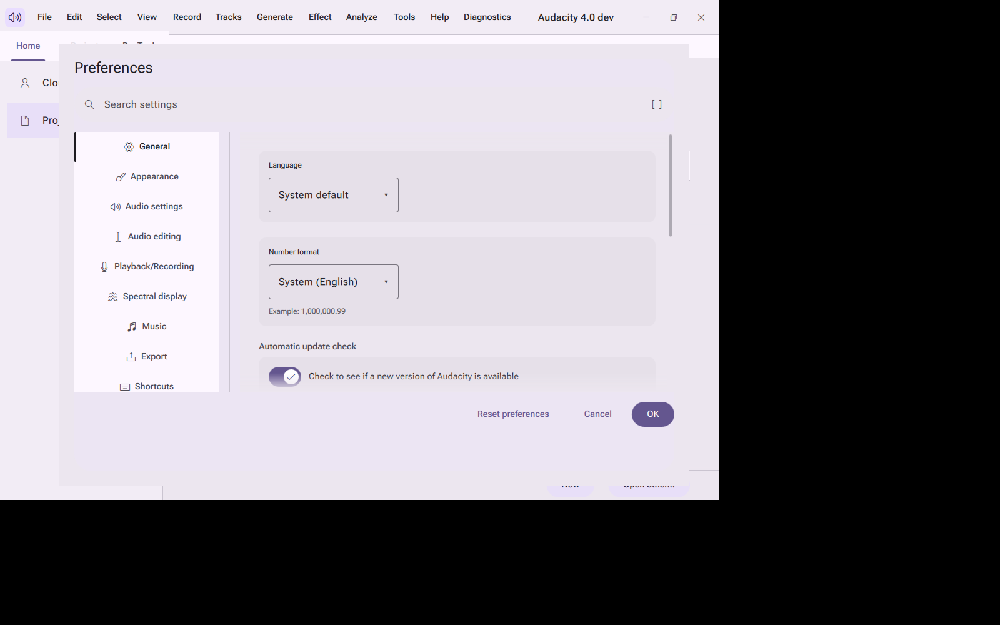

Preferences dialog: Material 3 navigation rail, a settings search field,
and the General page. Capture: `lane-d`.

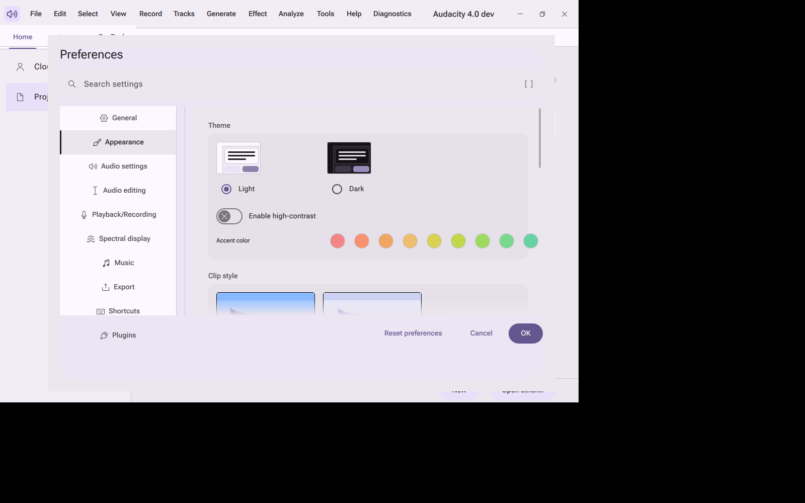

Appearance page: light and dark theme cards, a high contrast toggle, and a
row of accent color swatches. Capture: `lane-d`.

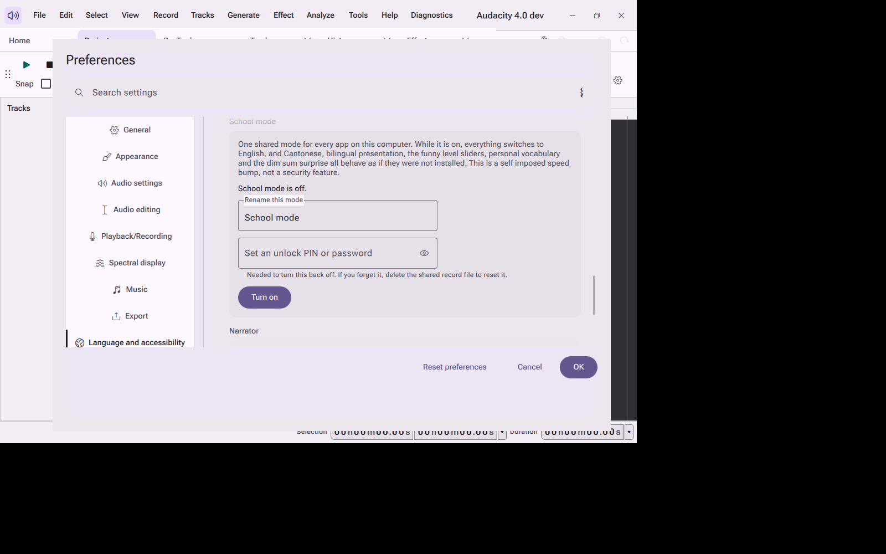

School mode section: a plain language explanation, a rename field, and a
PIN or password to turn it back off. Capture: `lane-k2`.

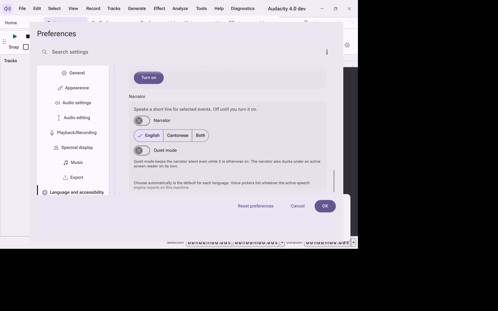

Narrator section: an off by default toggle, English or Cantonese or Both,
and a Quiet mode switch. Capture: `lane-k2`.

</details>

<details>
<summary><strong>Menus, tabs, and dialogs</strong></summary>

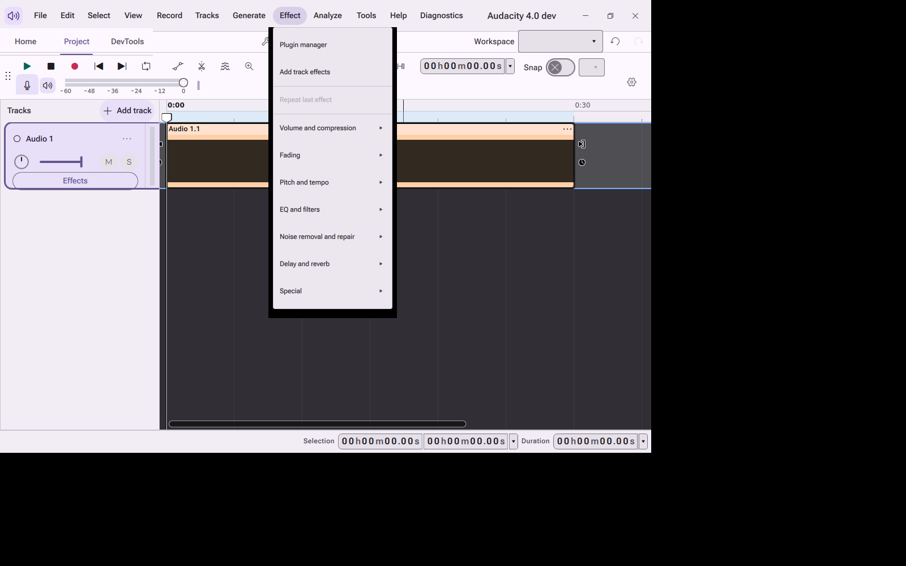

The Effect menu open over a project with a clip, and the browser style
Home, Project, DevTools tab strip above it. Capture: `lane-d`.

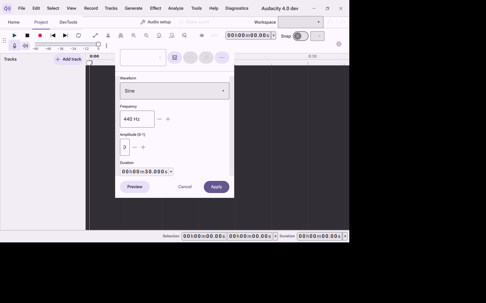

The Generate Tone dialog: waveform choice, frequency, amplitude, duration,
with Preview, Cancel, and Apply. Capture: `lane-d`.

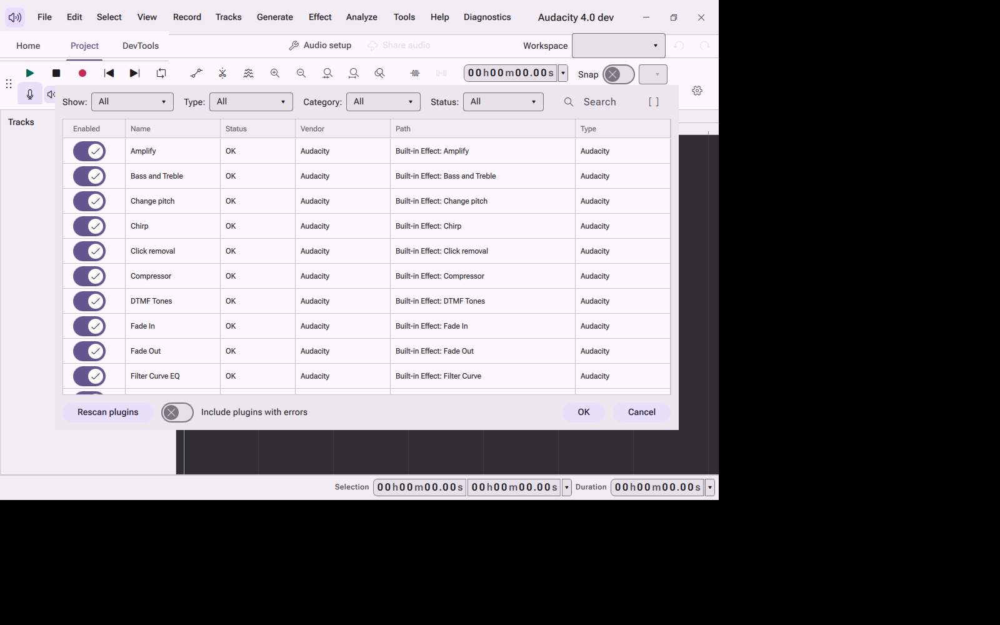

The plugin manager: a filterable, searchable table of every built-in
effect with per-row enable toggles. Capture: `lane-d`.

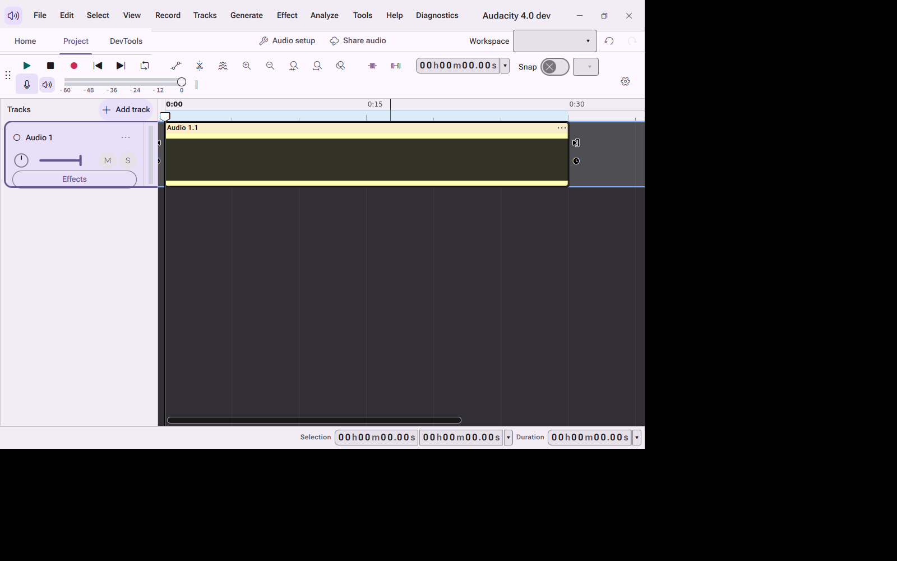

The Export dialog: file name, destination folder with a browse button,
format, channels, sample rate, and encoding. Capture: `lane-d`.

</details>

<details>
<summary><strong>Project window and tracks</strong></summary>

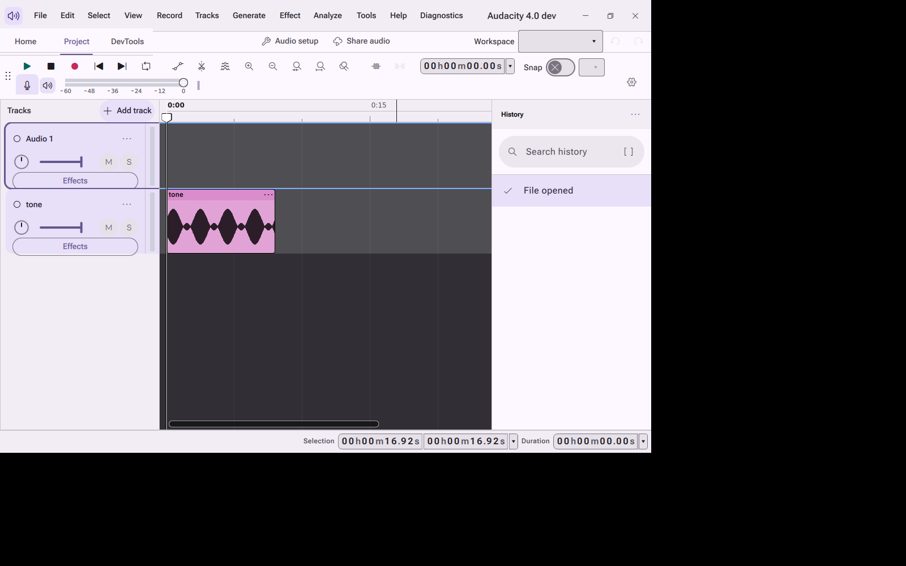

A project with one track and a generated tone clip, with the History panel
and its search field open on the right. Capture: `lane-c`.

</details>

<details>
<summary><strong>Design system</strong></summary>

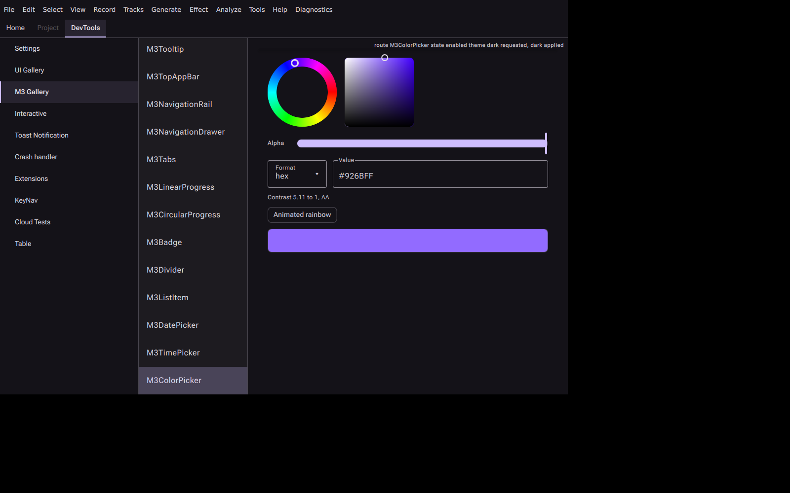

The internal Material 3 component gallery: hue wheel and saturation and
value field color picker, hex value, contrast readout, and the animated
rainbow option, dark theme. Capture: `lane-a`.

</details>

<details>
<summary><strong>Wave two features (dim sum surprise, pinned tabs)</strong></summary>

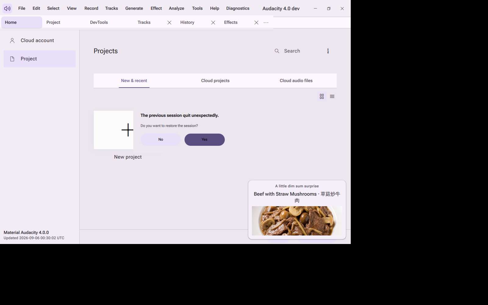

Several pinned tabs open (Project, DevTools, Tracks, History, Effects)
plus a dim sum surprise card naming a real dish with its photo. Capture:
`lane-k2`.

</details>

<details>
<summary><strong>Display scale</strong></summary>

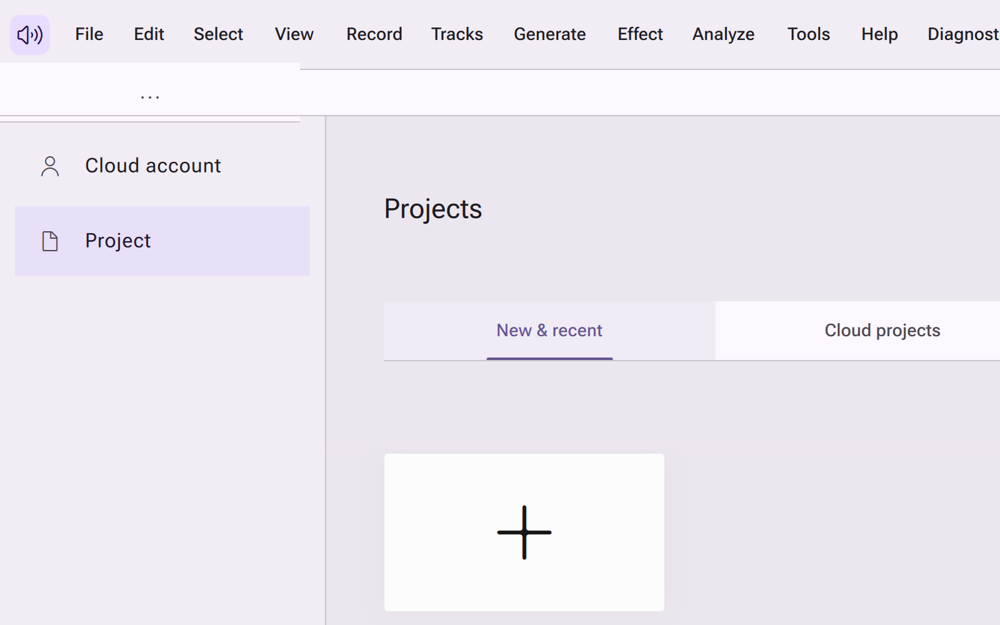

Home page at 200 percent display scale: menu bar, tab labels, and cards
all remain legible with no clipping. Capture: `phase2`.

</details>

<details>
<summary><strong>No capture yet</strong></summary>

These surfaces exist in the code but do not have a reviewed capture in
this pass: the toy lock wizard and PIN keypad, the built in authenticator's
QR pairing screen, the Support Tickets desk, the local model manager for
Ollama, the universal export service's non-audio formats, the in app
documentation browser and its bookmarks, the command palette itself, the
notification centre and corner toast stack, the updater's "Restart to
install" banner, and the attention support mode toggles. See
[HANDOFF.md](HANDOFF.md) for the current gap list; more captures under
[docs/design/captures/](docs/design/captures/) exist from earlier passes
(lanes `lane-b`, `lane-d`, `lane-g2`, `lane-p`, `lane-s`, `phase1`) and may
cover some of these once reviewed.

</details>

## Features

<details>
<summary><strong>Material Design 3 design system</strong></summary>

- A complete Material 3 token engine (color roles, typography scale, shape,
  elevation, motion, state layers) and component library under
  `src/uicomponents/qml/Audacity/M3/`, used throughout the shell with no
  legacy chrome remaining in the rebuilt surfaces.
- A per element appearance editor reachable from every element's right click
  menu and Shift+right-click: typography, color with an animated rainbow
  option, corner radius, and per state overrides.
  See [docs/features/appearance-editor.md](docs/features/appearance-editor.md).
- A live gallery of every Material 3 component and color token for visual
  review.

</details>

<details>
<summary><strong>Editing surfaces rebuilt in Material 3</strong></summary>

The project scene, toolbars, track headers, clips, history panel, home page,
title bar, about and first launch setup, preferences, effects, project and
export dialogs are rebuilt with Material 3 components. See
[docs/design/COMPONENTS.md](docs/design/COMPONENTS.md) for the component
inventory.

</details>

<details open>
<summary><strong>Every feature, one line each</strong></summary>

| Feature | Article |
| --- | --- |
| Language modes (English, playful Hong Kong Cantonese, bilingual) | [docs/features/language-modes.md](docs/features/language-modes.md) |
| Independent English and Cantonese funny level sliders | [docs/features/funny-levels.md](docs/features/funny-levels.md) |
| Emoji switch for dialogs and message boxes | [docs/features/emoji-switch.md](docs/features/emoji-switch.md) |
| Five attention support modes (focus, low stimulation, time awareness, one thing at a time, momentum) | [docs/features/attention-support-modes.md](docs/features/attention-support-modes.md) |
| Scheduled settings rules (local, HTTPS API, Home Assistant) | [docs/features/scheduled-settings.md](docs/features/scheduled-settings.md) |
| Local personal vocabulary JSON upload | [docs/features/personal-vocabulary.md](docs/features/personal-vocabulary.md) |
| Corner notification stack and notification centre | [docs/features/notifications.md](docs/features/notifications.md) |
| Super confirmation gate for destructive actions | [docs/features/super-confirmation.md](docs/features/super-confirmation.md) |
| Command palette on Ctrl+Shift+F | [docs/features/command-palette.md](docs/features/command-palette.md) |
| Regular expression builder workbench | [docs/features/regex-builder.md](docs/features/regex-builder.md) |
| Background Squirrel.Windows update checker | [docs/features/automatic-updates.md](docs/features/automatic-updates.md) |
| Per element appearance editor | [docs/features/appearance-editor.md](docs/features/appearance-editor.md) |
| Application display name setting | [docs/features/app-rename.md](docs/features/app-rename.md) |
| Toy locks with six credential policies and a shared PIN keypad | [docs/features/toy-locks.md](docs/features/toy-locks.md) |
| Support Tickets joke desk (its one real action opens the application data folder) | [docs/features/support-tickets.md](docs/features/support-tickets.md) |
| Local offline authenticator with an in process QR code and RFC 6238 codes | [docs/features/authenticator.md](docs/features/authenticator.md) |
| Local model manager for the Ollama HTTP API | [docs/features/ollama-suite-manager.md](docs/features/ollama-suite-manager.md) |
| Universal export service (JSON, JSON Lines, YAML, TOML, XML, CSV, TSV, Markdown, HTML, SQL, store only ZIP) | [docs/features/exports.md](docs/features/exports.md) |
| Reusable bulk selection control | [docs/features/bulk-actions.md](docs/features/bulk-actions.md) |
| External code editor detection and handoff | [docs/features/external-editor.md](docs/features/external-editor.md) |
| In app documentation browser, with bookmarks, search, and export | [docs/features/docs-browser.md](docs/features/docs-browser.md) |
| Tab navigation for the main page switcher | [docs/features/tab-navigation.md](docs/features/tab-navigation.md) |
| Local version history, separate from your project undo stack | [docs/features/local-history.md](docs/features/local-history.md) |
| Changelog and "what's new" viewer | [docs/features/changelog.md](docs/features/changelog.md) |
| Dim sum surprise: a 10% chance at startup of a bilingual dish name and a real photo | [docs/features/dim-sum-surprise.md](docs/features/dim-sum-surprise.md) |
| School mode: one shared speed bump across every app, off by default, locked by a PIN or password | [docs/features/school-mode.md](docs/features/school-mode.md) |
| Narrator: an off by default spoken narrator for app events | [docs/features/narrator.md](docs/features/narrator.md) |
| Status reporting for long running operations | [docs/features/status-reporting.md](docs/features/status-reporting.md) |

See [docs/features/](docs/features/) for the full set of articles, and
[docs/inventory/completeness-inventory.md](docs/inventory/completeness-inventory.md)
for the feature completeness tracking table.

</details>

## No unsolicited interruptions

Material Audacity never opens an unsolicited dialog, banner, or notification
asking for payment, ratings, reviews, or an upgrade. Any account, purchase,
or feedback flow the app offers is user initiated and non blocking. See
[docs/features/no-nagging.md](docs/features/no-nagging.md).

## Build and install

<details open>
<summary><strong>Windows, fresh machine, one command</strong></summary>

```bat
git clone --recurse-submodules https://github.com/Ding-Ding-Projects/audacity.git
cd audacity
.\build.bat --run
```

`build.bat` installs every dependency it needs (Qt 6.10.1 and the packaging
tools) automatically, configures and builds RelWithDebInfo into
`build\windows`, installs into `build.install`, and with `--run` (or `/run`,
or `RUN_AFTER_BUILD=1`) launches the built application. Silent mode is
`build.bat /s` and never launches automatically.

To build the installer separately:

```bat
download-dependencies.bat
build.bat /s
build-installer.bat /s
```

`download-dependencies.bat` verifies the toolchain and installs Qt 6.10.1
and the packaging tools on their own, so it can also be run standalone.
`build-installer.bat` produces the Squirrel.Windows installer in
`dist\squirrel-windows`.

The installer is intentionally **not code signed**. Code signing is
permanently prohibited for this project, so Windows SmartScreen shows a
warning on first run. Verify the download yourself instead, in PowerShell:

```powershell
# The hash must match the matching line in the published SHA256SUMS file.
Get-FileHash .\Setup.exe -Algorithm SHA256

# The expected and only acceptable status is NotSigned.
(Get-AuthenticodeSignature .\Setup.exe).Status
```

</details>

<details>
<summary><strong>Linux</strong></summary>

```bash
./build.sh
```

Linux builds are published as an AppImage on the releases page once a
release is cut. The full release contract, artifact list and verification
procedure are documented in [docs/design/RELEASE.md](docs/design/RELEASE.md).

</details>

## Automatic updates

Installed Windows copies check a configured HTTPS Squirrel.Windows feed in
the background and validate the feed metadata and package hash before
staging an update. A non blocking banner offers "Restart to install update"
and "Later"; nothing installs without that explicit choice. The feed is
unsigned by design and the app never claims signature verification, only
hash verification against the published feed. See
[docs/features/automatic-updates.md](docs/features/automatic-updates.md).

## Languages and accessibility

Material Audacity ships with English, playful Hong Kong Cantonese, and a
bilingual mode, applied live to the interface translator where the platform
allows it, plus independent funny level sliders per language for message
copy. See [docs/features/language-modes.md](docs/features/language-modes.md)
and [docs/features/funny-levels.md](docs/features/funny-levels.md).

Every control has an accessible name, keyboard focus, a visible focus ring,
and at least a 48dp touch target. Motion respects the operating system's
reduced motion preference through the shared `M3.reducedMotion` token, and
the interface is checked for clipping at narrow widths and 200% display
scale (see the [display scale capture](#screenshots) above). If you find an
accessibility problem, please open an issue.

## Line count and estimated build time

The table below is generated by the repository's own counter,
`buildscripts/ci/tools/count_lines.py`, run over `src`, `docs/site`, and
`buildscripts` (the vendored `muse`, `au3`, `thirdparty`, and `muse_deps`
trees are excluded because they are not this project's own code).

| Language | Files | Lines | Non blank lines |
| --- | ---: | ---: | ---: |
| C++ | 683 | 141617 | 118117 |
| QML | 450 | 71317 | 56414 |
| C/C++ header | 851 | 48505 | 38523 |
| CMake | 112 | 6852 | 5733 |
| Python | 13 | 2667 | 2209 |
| JavaScript | 8 | 2316 | 2134 |
| Markdown | 34 | 2187 | 1689 |
| C | 4 | 1882 | 1559 |
| JSON | 7 | 1699 | 1699 |
| Shell | 17 | 1354 | 1142 |
| HTML | 4 | 971 | 848 |
| PowerShell | 1 | 549 | 463 |
| Qt resource | 24 | 455 | 452 |
| Objective-C++ | 4 | 438 | 369 |
| CSS | 3 | 302 | 275 |
| Windows resource | 1 | 40 | 37 |
| **Total** | **2216** | **283151** | **231663** |

**Estimated human build time: roughly 7 to 9 person years, as an estimate
only.** Method: 231,663 non blank lines (from the table above) divided by an
assumed sustained rate of 12 to 15 written and reviewed lines per hour for
production quality, multi language desktop software (design, implementation,
review, and fixing included), then divided by 2,080 working hours per year.
This is not a measured figure, nobody actually built this project by hand,
and it excludes the vendored `muse`, `au3`, `thirdparty`, and `muse_deps`
trees exactly as the line count above does.

## Verification

What has been verified: the Linux build target links and runs (`./build.sh`
followed by the runtime smoke recipe below); real Xvfb captures of the
running application, reviewed by hand, are the screenshots above and under
[docs/design/captures/](docs/design/captures/); the repository's own gtest
suites exist and build under `MUSE_ENABLE_UNIT_TESTS=ON`, including
`src/experience/tests` (dozens of test cases covering the dim sum surprise,
School mode, narrator, and scheduled settings) and `src/toolkit/tests`
(bookmarks, bulk selection, exports, hardware fit, and harness profiles).

Runtime smoke recipe:

```bash
QT_QPA_PLATFORM=xcb AU_ALLOW_MULTIPLE_PROCESSES=1 xvfb-run -a -s "-screen 0 1600x1000x24" ./build/linux/src/app/audacity &
sleep 25
import -window root capture.png
```

What is **not** verified in this pass: a Windows build and runtime (no
Windows machine was used to produce these captures); most preference pages
beyond the ones captured above; a fresh CI run of the full test suite;
the packaged Squirrel.Windows installer's unsigned status on a real Windows
install. See [HANDOFF.md](HANDOFF.md) for the current state of each of
these and [docs/design/RELEASE.md](docs/design/RELEASE.md) for the release
verification procedure once a build is cut.

## Screen recording

No screen recording exists yet for this project. A short recording of a
real build reaching the home page and completing one editing task, taken
through the project's own headless capture route, will be added here once
that pass is done. See [HANDOFF.md](HANDOFF.md).

## Contributing and license

Material Audacity is a fork of [Audacity](https://www.audacityteam.org),
open source software licensed GPLv3. Most code files are GPLv2-or-later,
with the notable exceptions being `/au3/lib-src` (which contains third
party libraries), as well as VST3-related code. Documentation is licensed
CC-by 3.0 unless otherwise noted. Details are in the
[license file](LICENSE.txt).

Contribution guidance for the upstream project is in
[CONTRIBUTING.md](CONTRIBUTING.md) if present, and issues and discussions
for this fork will be opened once the repository owner enables them; see
[HANDOFF.md](HANDOFF.md).

---

This page uses a social preview image at `social-preview.png` in the
repository root, sized 1280x640, so a pasted link to this repository shows
a real picture instead of a plain card. The repository owner still needs to
upload it manually under Settings, General, Social preview, because GitHub
does not expose that setting through a script or the command line API; see
[HANDOFF.md](HANDOFF.md) for the exact pending step.
