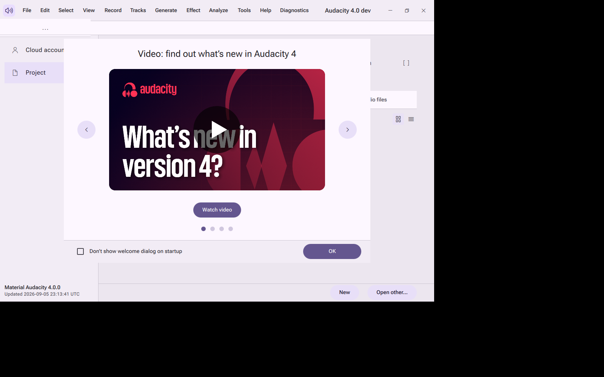
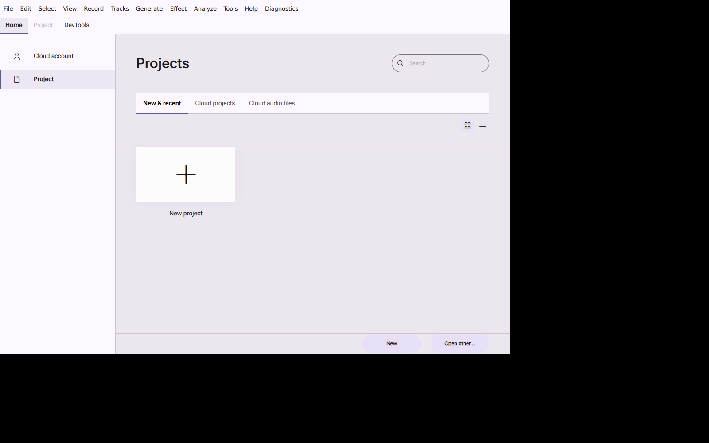
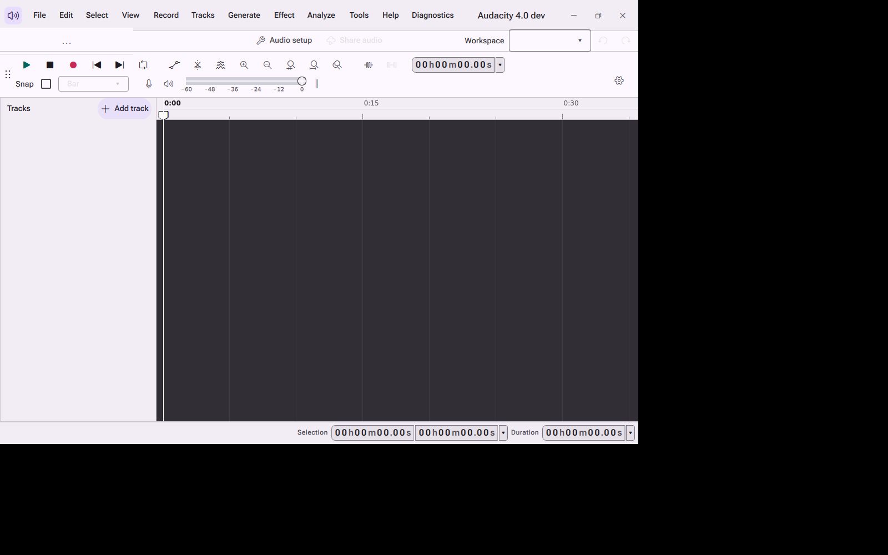
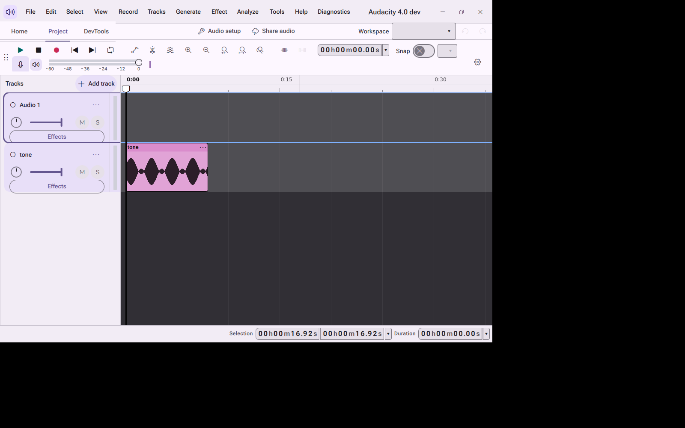

# Material Audacity

[](https://github.com/audacity/audacity/actions/workflows/au4_check_unit_tests.yml)

Material Audacity is a Material Design 3 rebuild of the Audacity 4 shell: an
easy to use, multi track audio editor and recorder for Windows and Linux,
rebuilt with a full Material 3 token engine, component library, and a large
set of accessibility, customization, and productivity features layered on
top of the original editing engine. The upstream project is
[Audacity](https://www.audacityteam.org).

Fresh Windows machine, one command:

```bat
.\build.bat --run
```

Documentation site: [docs/site](docs/site/index.html) (published at
`https://ding-ding-projects.github.io/audacity/` once GitHub Pages is
enabled by the repository owner, see [HANDOFF.md](HANDOFF.md)).

Contents: [Features](#features) · [Screenshots](#screenshots) ·
[Screen recording](#screen-recording) · [Build and install](#build-and-install) ·
[Automatic updates](#automatic-updates) · [Languages](#languages) ·
[Accessibility](#accessibility) ·
[Line count and estimated build time](#line-count-and-estimated-build-time) ·
[Contributing and license](#contributing-and-license)

## Features

<details>
<summary><strong>Material Design 3 design system</strong></summary>

- A complete Material 3 token engine (color roles, typography scale, shape,
  elevation, motion, state layers) and component library under
  `src/uicomponents/qml/Audacity/M3/`, used throughout the shell with no
  legacy chrome remaining in the rebuilt surfaces.
- A per element appearance editor reachable from every element's right click
  menu and Shift+right-click: typography, color with an animated rainbow
  option, corner radius, and per state overrides.
  See [docs/features/appearance-editor.md](docs/features/appearance-editor.md).
- A live gallery of every Material 3 component and color token for visual
  review.

</details>

<details>
<summary><strong>Editing surfaces rebuilt in Material 3</strong></summary>

The project scene, toolbars, track headers, clips, history panel, home page,
title bar, about and first launch setup, preferences, effects, project and
export dialogs are rebuilt with Material 3 components. See
[docs/design/COMPONENTS.md](docs/design/COMPONENTS.md) for the component
inventory.

</details>

<details>
<summary><strong>Companion features (every one documented separately)</strong></summary>

| Feature | Article |
| --- | --- |
| Language modes (English, playful Hong Kong Cantonese, bilingual) | [docs/features/language-modes.md](docs/features/language-modes.md) |
| Independent English and Cantonese funny level sliders | [docs/features/funny-levels.md](docs/features/funny-levels.md) |
| Emoji switch for dialogs and message boxes | [docs/features/emoji-switch.md](docs/features/emoji-switch.md) |
| Five attention support modes (focus, low stimulation, time awareness, one thing at a time, momentum) | [docs/features/attention-support-modes.md](docs/features/attention-support-modes.md) |
| Scheduled settings rules (local, HTTPS API, Home Assistant) | [docs/features/scheduled-settings.md](docs/features/scheduled-settings.md) |
| Local personal vocabulary JSON upload | [docs/features/personal-vocabulary.md](docs/features/personal-vocabulary.md) |
| Corner notification stack and notification centre | [docs/features/notifications.md](docs/features/notifications.md) |
| Super confirmation gate for destructive actions | [docs/features/super-confirmation.md](docs/features/super-confirmation.md) |
| Command palette on Ctrl+Shift+F | [docs/features/command-palette.md](docs/features/command-palette.md) |
| Regular expression builder workbench | [docs/features/regex-builder.md](docs/features/regex-builder.md) |
| Background Squirrel.Windows update checker | [docs/features/automatic-updates.md](docs/features/automatic-updates.md) |
| Per element appearance editor | [docs/features/appearance-editor.md](docs/features/appearance-editor.md) |
| Application display name setting | [docs/features/app-rename.md](docs/features/app-rename.md) |
| Toy locks with six credential policies and a shared PIN keypad | [docs/features/toy-locks.md](docs/features/toy-locks.md) |
| Support Tickets joke desk (its one real action opens the application data folder) | [docs/features/support-tickets.md](docs/features/support-tickets.md) |
| Local offline authenticator with an in process QR code and RFC 6238 codes | [docs/features/authenticator.md](docs/features/authenticator.md) |
| Local model manager for the Ollama HTTP API | [docs/features/ollama-suite-manager.md](docs/features/ollama-suite-manager.md) |
| Universal export service (JSON, JSON Lines, YAML, TOML, XML, CSV, TSV, Markdown, HTML, SQL, store only ZIP) | [docs/features/exports.md](docs/features/exports.md) |
| Reusable bulk selection control | [docs/features/bulk-actions.md](docs/features/bulk-actions.md) |
| External code editor detection and handoff | [docs/features/external-editor.md](docs/features/external-editor.md) |
| In app documentation browser | [docs/features/docs-browser.md](docs/features/docs-browser.md) |
| Tab navigation for the main page switcher | [docs/features/tab-navigation.md](docs/features/tab-navigation.md) |
| Local version history, separate from your project undo stack | [docs/features/local-history.md](docs/features/local-history.md) |
| Changelog and "what's new" viewer | [docs/features/changelog.md](docs/features/changelog.md) |

See [docs/features/](docs/features/) for the full set of articles, and
[docs/inventory/completeness-inventory.md](docs/inventory/completeness-inventory.md)
for the feature completeness tracking table.

</details>

## Screenshots

<details open>
<summary><strong>Real captures from the built application</strong></summary>

Every image below is a real capture taken under Xvfb from the actual built
binary, not a mockup.



Home page, light theme, Material 3 shell.



Home page welcome state.



The browser style tab strip used for the main page switcher.


Preferences shell with the Material 3 navigation rail.


Appearance settings.


Effect menu rebuilt with Material 3 menu components.



Track view with a clip, Material 3 track header and ruler.


The undo history panel.


Material 3 color picker in the component gallery, dark theme.

More captures, including the first launch flow, the About dialog, plugin
manager, and export dialog, are under
[docs/design/captures/](docs/design/captures/), organized by the lane that
took them.

Surfaces added in the current development cycle that do not yet have a
capture: the toy lock wizard and PIN keypad, the built in authenticator's QR
pairing screen, the Support Tickets desk, the local model manager for
Ollama, the universal export dialog, the in app documentation browser, and
the attention support mode toggles. These will be captured as part of the
next verification pass; see [HANDOFF.md](HANDOFF.md) for the current gap
list.

</details>

## Screen recording

No screen recording exists yet for this project. A short recording of a
real build reaching the home page and completing one editing task, taken
through the project's own headless capture route, will be added here once
that pass is done. See [HANDOFF.md](HANDOFF.md).

## Build and install

<details open>
<summary><strong>Windows, fresh machine, one command</strong></summary>

```bat
git clone --recurse-submodules https://github.com/Ding-Ding-Projects/audacity.git
cd audacity
.\build.bat --run
```

`build.bat` installs every dependency it needs (Qt 6.10.1 and the packaging
tools) automatically, configures and builds RelWithDebInfo into
`build\windows`, installs into `build.install`, and with `--run` (or `/run`,
or `RUN_AFTER_BUILD=1`) launches the built application. Silent mode is
`build.bat /s` and never launches automatically.

To build the installer separately:

```bat
download-dependencies.bat
build.bat /s
build-installer.bat /s
```

`download-dependencies.bat` verifies the toolchain and installs Qt 6.10.1
and the packaging tools on their own, so it can also be run standalone.
`build-installer.bat` produces the Squirrel.Windows installer in
`dist\squirrel-windows`.

The installer is intentionally **not code signed**. Code signing is
permanently prohibited for this project, so Windows SmartScreen shows a
warning on first run. Verify the download yourself instead, in PowerShell:

```powershell
# The hash must match the matching line in the published SHA256SUMS file.
Get-FileHash .\Setup.exe -Algorithm SHA256

# The expected and only acceptable status is NotSigned.
(Get-AuthenticodeSignature .\Setup.exe).Status
```

</details>

<details>
<summary><strong>Linux</strong></summary>

```bash
./build.sh
```

Linux builds are published as an AppImage on the releases page once a
release is cut. The full release contract, artifact list and verification
procedure are documented in [docs/design/RELEASE.md](docs/design/RELEASE.md).

</details>

## Automatic updates

Installed Windows copies check a configured HTTPS Squirrel.Windows feed in
the background and validate the feed metadata and package hash before
staging an update. A non blocking banner offers "Restart to install update"
and "Later"; nothing installs without that explicit choice. The feed is
unsigned by design and the app never claims signature verification, only
hash verification against the published feed. See
[docs/features/automatic-updates.md](docs/features/automatic-updates.md).

## Languages

Material Audacity ships with English, playful Hong Kong Cantonese, and a
bilingual mode, applied live to the interface translator where the platform
allows it, plus independent funny level sliders per language for message
copy. See [docs/features/language-modes.md](docs/features/language-modes.md)
and [docs/features/funny-levels.md](docs/features/funny-levels.md).

## Accessibility

Every control has an accessible name, keyboard focus, a visible focus ring,
and at least a 48dp touch target. Motion respects the operating system's
reduced motion preference through the shared `M3.reducedMotion` token, and
the interface is checked for clipping at narrow widths and 200% display
scale. If you find an accessibility problem, please open an issue.

## Line count and estimated build time

The table below is generated by the repository's own counter,
`buildscripts/ci/tools/count_lines.py`, run over `src`, `docs/site`, and
`buildscripts` (the vendored `muse`, `au3`, `thirdparty`, and `muse_deps`
trees are excluded because they are not this project's own code).

| Language | Files | Lines | Non blank lines |
| --- | ---: | ---: | ---: |
| C++ | 674 | 140245 | 116946 |
| QML | 446 | 70330 | 55600 |
| C/C++ header | 848 | 48146 | 38211 |
| CMake | 111 | 6761 | 5651 |
| JavaScript | 8 | 2271 | 2090 |
| Python | 11 | 2221 | 1833 |
| C | 4 | 1882 | 1559 |
| Markdown | 29 | 1784 | 1368 |
| JSON | 6 | 1542 | 1542 |
| Shell | 16 | 1290 | 1093 |
| HTML | 4 | 969 | 846 |
| PowerShell | 1 | 549 | 463 |
| Qt resource | 24 | 455 | 452 |
| Objective-C++ | 4 | 438 | 369 |
| CSS | 3 | 302 | 275 |
| Windows resource | 1 | 40 | 37 |
| **Total** | **2190** | **279225** | **228335** |

**Estimated human build time: roughly 7 to 9 person years, as an estimate
only.** Method: 228,335 non blank lines (from the table above) divided by an
assumed sustained rate of 12 to 15 written and reviewed lines per hour for
production quality, multi language desktop software (design, implementation,
review, and fixing included), then divided by 2,080 working hours per year.
This is not a measured figure, nobody actually built this project by hand,
and it excludes the vendored `muse`, `au3`, `thirdparty`, and `muse_deps`
trees exactly as the line count above does.

## Contributing and license

Material Audacity is a fork of [Audacity](https://www.audacityteam.org),
open source software licensed GPLv3. Most code files are GPLv2-or-later,
with the notable exceptions being `/au3/lib-src` (which contains third
party libraries), as well as VST3-related code. Documentation is licensed
CC-by 3.0 unless otherwise noted. Details are in the
[license file](LICENSE.txt).

Contribution guidance for the upstream project is in
[CONTRIBUTING.md](CONTRIBUTING.md) if present, and issues and discussions
for this fork will be opened once the repository owner enables them; see
[HANDOFF.md](HANDOFF.md).

---

This page uses a social preview image at `social-preview.png` in the
repository root, sized 1280x640, so a pasted link to this repository shows
a real picture instead of a plain card. The repository owner still needs to
upload it manually under Settings, General, Social preview, because GitHub
does not expose that setting through a script or the command line API; see
[HANDOFF.md](HANDOFF.md) for the exact pending step.
